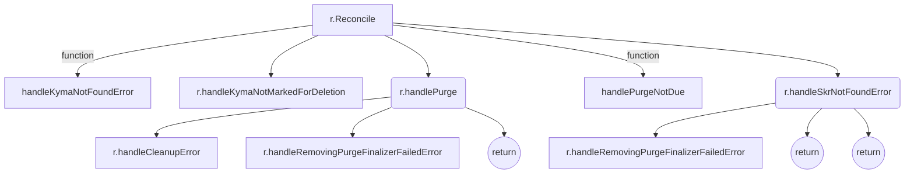

---
# You can also start simply with 'default'
theme: default
# random image from a curated Unsplash collection by Anthony
# like them? see https://unsplash.com/collections/94734566/slidev
background: https://cover.sli.dev
# some information about your slides (markdown enabled)
title: Welcome to Slidev
info: |
  ## Slidev Starter Template
  Presentation slides for developers.

  Learn more at [Sli.dev](https://sli.dev)
# apply unocss classes to the current slide
class: text-center
# https://sli.dev/features/drawing
drawings:
  persist: false
# slide transition: https://sli.dev/guide/animations.html#slide-transitions
transition: slide-left
# enable MDC Syntax: https://sli.dev/features/mdc
mdc: true
# take snapshot for each slide in the overview
overviewSnapshots: true
---

# Quality: Lifecycle-Manager

### Making our reconcilers testable

<div class="pt-12">
  <span @click="$slidev.nav.next" class="px-2 py-1 rounded cursor-pointer" hover="bg-white bg-opacity-10">
    Press Space for next page <carbon:arrow-right class="inline"/>
  </span>
</div>

<div class="abs-br m-6 flex gap-2">
  <button @click="$slidev.nav.openInEditor()" title="Open in Editor" class="text-xl slidev-icon-btn opacity-50 !border-none !hover:text-white">
    <carbon:edit />
  </button>
  <a href="https://github.com/slidevjs/slidev" target="_blank" alt="GitHub" title="Open in GitHub"
    class="text-xl slidev-icon-btn opacity-50 !border-none !hover:text-white">
    <carbon-logo-github />
  </a>
</div>

<!--
The last comment block of each slide will be treated as slide notes. It will be visible and editable in Presenter Mode along with the slide. [Read more in the docs](https://sli.dev/guide/syntax.html#notes)
-->

---
transition: slide-left
---

# Recap of the last session

#### We have a big quality issue in the current reconciliation code - it's not unit-testable.


<v-click>

Primary reasons:

</v-click>

<v-clicks>

- Long functions with multiple responsibilities
- Functions/methods are directly calling other functions/methods.
- This makes entire reconciliation logic one huge "unit" - although it's divided into multiple functions, they are all tightly coupled at compile time.

</v-clicks>

<!--
You can have `style` tag in markdown to override the style for the current page.
Learn more: https://sli.dev/features/slide-scope-style
-->

<style>
h1 {
  background-color: #2B90B6;
  background-size: 100%;
  -webkit-background-clip: text;
  -moz-background-clip: text;
  -webkit-text-fill-color: transparent;
  -moz-text-fill-color: transparent;
}
ul {
  font-size: 1rem;
}
</style>

<!--
Here is another comment.
-->

---
transition: fade
---

# Example: Purge Reconciler

```go{*}{maxHeight:'400px'}
func (r *Reconciler) Reconcile(ctx context.Context, req ctrl.Request) (ctrl.Result, error) {
        [...]
        kyma := &v1beta2.Kyma{}
        if err := r.Get(ctx, req.NamespacedName, kyma); err != nil {
                return handleKymaNotFoundError(logger, kyma, err)
        }

        if kyma.DeletionTimestamp.IsZero() {
                return r.handleKymaNotMarkedForDeletion(ctx, kyma)
        }

        if requeueAfter := r.calculateRequeueAfterTime(kyma); requeueAfter != 0 {
                return handlePurgeNotDue(logger, kyma, requeueAfter)
        }

        err := r.SkrContextFactory.Init(ctx, kyma.GetNamespacedName())
        if err != nil {
                return r.handleSkrNotFoundError(ctx, kyma, err)
        }

        skrContext, err := r.SkrContextFactory.Get(kyma.GetNamespacedName())
        if err != nil {
                return r.handleSkrNotFoundError(ctx, kyma, err)
        }

        return r.handlePurge(ctx, kyma, skrContext.Client, time.Now())
}
```

<v-click>

<span font-size='0.8rem'>This code is a perfect example of a "Dispatcher": it calls other functions ("handlers") based on the state of the Kyma object and other conditions.</span>

</v-click>

<style>
h1 {
  background-color: #2B90B6;
  background-size: 100%;
  -webkit-background-clip: text;
  -moz-background-clip: text;
  -webkit-text-fill-color: transparent;
  -moz-text-fill-color: transparent;
ul {
  font-size: 1rem;
}
}
</style>

<!--
Take a look at this function. It is essentially a dispatcher function that calls other functions depending on the state of the Kyma object and other conditions.
-->

---
transition: slide-left
---

# Call graph of the Reconcile() function

<div>
<p>&nbsp;</p>
</div>



<br/>
<v-clicks>

- Our logic is divided into multiple functions tightly coupled at compilation time.
- The logic defines many execution paths, selected conditionally based on the state of the Kyma object and the environment.
- It may be possible, albeit it's difficult and fragile, to mock the "environmental" dependencies (like k8s-client) to precisely test the code along each execution path via the top-level "Reconcile" function interface.

</v-clicks>

<style>
h1 {
  background-color: #2B90B6;
  background-size: 100%;
  -webkit-background-clip: text;
  -moz-background-clip: text;
  -webkit-text-fill-color: transparent;
  -moz-text-fill-color: transparent;
}
ul {
  font-size: 1rem;
}
</style>

---
transition: slide-left
---

# Recap of the last session

<br/>

- We identified and described the problem
- We reviewed some of the existing projects in order to find a solution
- We haven't found a satisfying solution
- We decided to continue the search for it

<br/>

<style>
h1 {
  background-color: #2B90B6;
  background-size: 100%;
  -webkit-background-clip: text;
  -moz-background-clip: text;
  -webkit-text-fill-color: transparent;
  -moz-text-fill-color: transparent;
}
ul {
  font-size: 1rem;
}
</style>

---
transition: slide-left
---

# New Ideas

<br/>

<v-clicks depth="2">

- Design Patterns?
     - Probably it's not the <strong class="personal">right time</strong> to do it
     - We must be able to <strong class="personal">properly test</strong> the code first, and only then condider any large-scale refactorings.
- I decided I will try out the following "exercise": I want a solution based purely on existing golang features.
     - And that I will only consider any additional framework (whether our own or external) if I hit the wall.

</v-clicks>

<style>
h1 {
  background-color: #2B90B6;
  background-size: 100%;
  -webkit-background-clip: text;
  -moz-background-clip: text;
  -webkit-text-fill-color: transparent;
  -moz-text-fill-color: transparent;
}
ul {
  font-size: 1rem;
}

.personal {
  color: #2B90B6;
  font-weight:900;
}

</style>

---
transition: fade
---

# Exercise: Function refactoring


```go{*}{maxHeight:'300px'}
func (r *Reconciler) Reconcile(ctx context.Context, req ctrl.Request) (ctrl.Result, error) {

        kyma := &v1beta2.Kyma{}
        if err := r.Get(ctx, req.NamespacedName, kyma); err != nil {
                return handleKymaNotFoundError(logger, kyma, err)
        }

        if kyma.DeletionTimestamp.IsZero() {
                return r.handleKymaNotMarkedForDeletion(ctx, kyma)
        }

        return ctrl.Result{RequeueAfter: 10*time.Second}, nil
}
```

<br/>

<v-clicks>

- The pattern: either return the result directly or pass the control to some <strong class="personal">next handler in the chain</strong>.

</v-clicks>

<style>
h1 {
  background-color: #2B90B6;
  background-size: 100%;
  -webkit-background-clip: text;
  -moz-background-clip: text;
  -webkit-text-fill-color: transparent;
  -moz-text-fill-color: transparent;
}
ul {
  font-size: 1rem;
}
.personal {
  color: #2B90B6;
  font-weight:900;
}
</style>


---
transition: fade
---

# Exercise: Function refactoring


```go{5,9,12}{maxHeight:'300px'}
func (r *Reconciler) Reconcile(ctx context.Context, req ctrl.Request) (ctrl.Result, error) {

        kyma := &v1beta2.Kyma{}
        if err := r.Get(ctx, req.NamespacedName, kyma); err != nil {
                return handleKymaNotFoundError(logger, kyma, err) // pass control to the next handler
        }

        if kyma.DeletionTimestamp.IsZero() {
                return r.handleKymaNotMarkedForDeletion(ctx, kyma) //pass control to the next handler
        }

        return ctrl.Result{RequeueAfter: 10*time.Second}, nil // return the result directly
}
```

<br/>

- The pattern: either return the result directly or pass the control to some <strong class="personal">next handler in the chain</strong>.

<v-clicks>

- The <strong class="personal">next handler in the chain</strong> is where the coupling happens.

</v-clicks>

<style>
h1 {
  background-color: #2B90B6;
  background-size: 100%;
  -webkit-background-clip: text;
  -moz-background-clip: text;
  -webkit-text-fill-color: transparent;
  -moz-text-fill-color: transparent;
}
ul {
  font-size: 1rem;
}
.personal {
  color: #2B90B6;
  font-weight:900;
}
</style>

---
transition: slide-left
---

# Exercise: Function refactoring


```go{5,9}{maxHeight:'300px'}
func (r *Reconciler) Reconcile(ctx context.Context, req ctrl.Request) (ctrl.Result, error) {

        kyma := &v1beta2.Kyma{}
        if err := r.Get(ctx, req.NamespacedName, kyma); err != nil {
                return handleKymaNotFoundError(logger, kyma, err) // a static compile-time dependency to a function
        }

        if kyma.DeletionTimestamp.IsZero() {
                return r.handleKymaNotMarkedForDeletion(ctx, kyma) // a static compile-time dependency to a method
        }

        return ctrl.Result{RequeueAfter: 10*time.Second}, nil
}
```

<br/>

- The pattern: either return the result directly or pass the control to some <strong class="personal">next handler in the chain</strong>.
- The <strong class="personal">next handler in the chain</strong> is where the coupling happens.

<v-clicks>

- We have a strong compile-time dependency on other code. We should handle these dependencies in the same way as all the others.

</v-clicks>

<style>
h1 {
  background-color: #2B90B6;
  background-size: 100%;
  -webkit-background-clip: text;
  -moz-background-clip: text;
  -webkit-text-fill-color: transparent;
  -moz-text-fill-color: transparent;
}
ul {
  font-size: 1rem;
}
.personal {
  color: #2B90B6;
  font-weight:900;
}
</style>

---
transition: slide-left
---

# Exercise: Function refactoring

<br/>

#### What are the options for <strong class="personal">replacing behavior</strong> in golang?

By replacing behavior I mean to be able to dynamically change the target code to be executed when calling a method or a function.

Without using dirty hacks, like reflection, I know of only two ways of dynamically configure the code to execute in golang:

<br/>

<v-clicks>

- Interfaces
  ```go
    var handler SomeInterface = ... // this is where we inject the concrete behavior 
    res, err := handler.doWork()
  ```
- Function values
  ```go
    var doWork func() (int, err) = ... // this is where we inject the concrete behavior
    res, err := doWork()
  ```

</v-clicks>

<style>
h1 {
  background-color: #2B90B6;
  background-size: 100%;
  -webkit-background-clip: text;
  -moz-background-clip: text;
  -webkit-text-fill-color: transparent;
  -moz-text-fill-color: transparent;
}
.personal {
  color: #2B90B6;
  font-weight:900;
}
</style>

---
transition: fade
---

# Exercise: Dependency Injection

<br/>

Step 1: Define the interface

```go
func (r *Reconciler) Reconcile(ctx context.Context, req ctrl.Request) (ctrl.Result, error) {

        kyma := &v1beta2.Kyma{}
        if err := r.Get(ctx, req.NamespacedName, kyma); err != nil {
                return handleKymaNotFoundError(logger, kyma, err)
        }

        if kyma.DeletionTimestamp.IsZero() {
                return r.handleKymaNotMarkedForDeletion(ctx, kyma)
        }

        return ctrl.Result{RequeueAfter: 10*time.Second}, nil
}

type reconcileReturnHandlers interface { // naming is always hard...
       handleKymaNotFoundError(logr.Logger, *v1beta2.Kyma, error) (ctrl.Result, error)
       handleKymaNotMarkedForDeletion(context.Context, *v1beta2.Kyma) (ctrl.Result, error)
}
```

<style>
h1 {
  background-color: #2B90B6;
  background-size: 100%;
  -webkit-background-clip: text;
  -moz-background-clip: text;
  -webkit-text-fill-color: transparent;
  -moz-text-fill-color: transparent;
}
ul {
  font-size: 1rem;
}
.personal {
  color: #2B90B6;
  font-weight:900;
}
</style>

---
transition: slide-left
---

# Exercise: Dependency Injection

<br/>

Step 1: Define the interface

```go{5,9,16,17}
func (r *Reconciler) Reconcile(ctx context.Context, req ctrl.Request) (ctrl.Result, error) {

        kyma := &v1beta2.Kyma{}
        if err := r.Get(ctx, req.NamespacedName, kyma); err != nil {
                return handleKymaNotFoundError(logger, kyma, err)
        }

        if kyma.DeletionTimestamp.IsZero() {
                return r.handleKymaNotMarkedForDeletion(ctx, kyma)
        }

        return ctrl.Result{RequeueAfter: 10*time.Second}, nil
}

type reconcileReturnHandlers interface { // naming is always hard...
       handleKymaNotFoundError(logr.Logger, *v1beta2.Kyma, error) (ctrl.Result, error)
       handleKymaNotMarkedForDeletion(context.Context, *v1beta2.Kyma) (ctrl.Result, error)
}
```

<style>
h1 {
  background-color: #2B90B6;
  background-size: 100%;
  -webkit-background-clip: text;
  -moz-background-clip: text;
  -webkit-text-fill-color: transparent;
  -moz-text-fill-color: transparent;
}
ul {
  font-size: 1rem;
}
.personal {
  color: #2B90B6;
  font-weight:900;
}
</style>

---
transition: fade
---

# Exercise: Dependency Injection

<br/>

Step 2: Use the interface

```go
type reconcileReturnHandlers interface { // naming is always hard...
       handleKymaNotFoundError(logr.Logger, *v1beta2.Kyma, error) (ctrl.Result, error)
       handleKymaNotMarkedForDeletion(context.Context, *v1beta2.Kyma) (ctrl.Result, error)
}

type Reconciler struct {
        client.Client
        next reconcileReturnHandlers // "next" kind-of fits the purpose of the interface
        [...]
}
```

<style>
h1 {
  background-color: #2B90B6;
  background-size: 100%;
  -webkit-background-clip: text;
  -moz-background-clip: text;
  -webkit-text-fill-color: transparent;
  -moz-text-fill-color: transparent;
}
ul {
  font-size: 1rem;
}
.personal {
  color: #2B90B6;
  font-weight:900;
}
</style>

---
transition: fade
---

# Exercise: Dependency Injection

<br/>

Step 2: Use the interface

```go
type Reconciler struct {
        client.Client
        next reconcileReturnHandlers // "next" kind-of fits the purpose of the interface
        [...]
}

func (r *Reconciler) Reconcile(ctx context.Context, req ctrl.Request) (ctrl.Result, error) {

        kyma := &v1beta2.Kyma{}
        if err := r.Get(ctx, req.NamespacedName, kyma); err != nil {
                return r.next.handleKymaNotFoundError(logger, kyma, err)
        }

        if kyma.DeletionTimestamp.IsZero() {
                return r.next.handleKymaNotMarkedForDeletion(ctx, kyma)
        }

        return ctrl.Result{RequeueAfter: 10*time.Second}, nil
}
```

<style>
h1 {
  background-color: #2B90B6;
  background-size: 100%;
  -webkit-background-clip: text;
  -moz-background-clip: text;
  -webkit-text-fill-color: transparent;
  -moz-text-fill-color: transparent;
}
ul {
  font-size: 1rem;
}
.personal {
  color: #2B90B6;
  font-weight:900;
}
</style>

---
transition: slide-left
---

# Exercise: Dependency Injection
<br/>

Step 2: Use the interface

```go{3,11,15}
type Reconciler struct {
        client.Client
        next reconcileReturnHandlers // "next" kind-of fits the purpose of the interface
        [...]
}

func (r *Reconciler) Reconcile(ctx context.Context, req ctrl.Request) (ctrl.Result, error) {

        kyma := &v1beta2.Kyma{}
        if err := r.Get(ctx, req.NamespacedName, kyma); err != nil {
                return r.next.handleKymaNotFoundError(logger, kyma, err) // use injected dependency
        }

        if kyma.DeletionTimestamp.IsZero() {
                return r.next.handleKymaNotMarkedForDeletion(ctx, kyma) // use injected dependency 
        }

        return ctrl.Result{RequeueAfter: 10*time.Second}, nil
}
```

<style>
h1 {
  background-color: #2B90B6;
  background-size: 100%;
  -webkit-background-clip: text;
  -moz-background-clip: text;
  -webkit-text-fill-color: transparent;
  -moz-text-fill-color: transparent;
}
ul {
  font-size: 1rem;
}
.personal {
  color: #2B90B6;
  font-weight:900;
}
</style>

---
transition: fade
---

# Pimp my code: Function values

<br/>

<span font-size='1rem'>If you don't like the `.next` part in the `r.next.handleKymaNotFoundError(...)`, we can do the following:</span>

```go
//type reconcileReturnHandlers interface {
//       handleKymaNotFoundError(logr.Logger, *v1beta2.Kyma, error) (ctrl.Result, error)
//       handleKymaNotMarkedForDeletion(context.Context, *v1beta2.Kyma) (ctrl.Result, error)
//}

type Reconciler struct {
        client.Client
        //next reconcileReturnHandlers // "next" kind-of fits the purpose of the interface
        handleKymaNotFoundError func(logr.Logger, *v1beta2.Kyma, error) (ctrl.Result, error)
        handleKymaNotMarkedForDeletion func(context.Context, *v1beta2.Kyma) (ctrl.Result, error)
        [...]
}
```
<br/>

_Note: The same effect can be achieved with interface embedding, but I prefer function values for this purpose._

<style>
h1 {
  background-color: #2B90B6;
  background-size: 100%;
  -webkit-background-clip: text;
  -moz-background-clip: text;
  -webkit-text-fill-color: transparent;
  -moz-text-fill-color: transparent;
}
ul {
  font-size: 1rem;
}
.personal {
  color: #2B90B6;
  font-weight:900;
}
</style>

---
transition: fade
---

# Pimp my code: Function values

<br/>

```go
type Reconciler struct {
        client.Client
        handleKymaNotFoundError func(logr.Logger, *v1beta2.Kyma, error) (ctrl.Result, error)
        handleKymaNotMarkedForDeletion func(context.Context, *v1beta2.Kyma) (ctrl.Result, error)
        [...]
}

func (r *Reconciler) Reconcile(ctx context.Context, req ctrl.Request) (ctrl.Result, error) {

        kyma := &v1beta2.Kyma{}
        if err := r.Get(ctx, req.NamespacedName, kyma); err != nil {
                return r.handleKymaNotFoundError(logger, kyma, err)
        }

        if kyma.DeletionTimestamp.IsZero() {
                return r.handleKymaNotMarkedForDeletion(ctx, kyma)
        }

        return ctrl.Result{RequeueAfter: 10*time.Second}, nil
}
```

<style>
h1 {
  background-color: #2B90B6;
  background-size: 100%;
  -webkit-background-clip: text;
  -moz-background-clip: text;
  -webkit-text-fill-color: transparent;
  -moz-text-fill-color: transparent;
}
ul {
  font-size: 1rem;
}
.personal {
  color: #2B90B6;
  font-weight:900;
}
</style>

---
transition: slide-left
---

# Pimp my code: Function values

<br/>

```go{3,4,12,16}
type Reconciler struct {
        client.Client
        handleKymaNotFoundError func(logr.Logger, *v1beta2.Kyma, error) (ctrl.Result, error)
        handleKymaNotMarkedForDeletion func(context.Context, *v1beta2.Kyma) (ctrl.Result, error)
        [...]
}

func (r *Reconciler) Reconcile(ctx context.Context, req ctrl.Request) (ctrl.Result, error) {

        kyma := &v1beta2.Kyma{}
        if err := r.Get(ctx, req.NamespacedName, kyma); err != nil {
                return r.handleKymaNotFoundError(logger, kyma, err) // use injected function value
        }

        if kyma.DeletionTimestamp.IsZero() {
                return r.handleKymaNotMarkedForDeletion(ctx, kyma) // use injected function value
        }

        return ctrl.Result{RequeueAfter: 10*time.Second}, nil
}
```

<style>
h1 {
  background-color: #2B90B6;
  background-size: 100%;
  -webkit-background-clip: text;
  -moz-background-clip: text;
  -webkit-text-fill-color: transparent;
  -moz-text-fill-color: transparent;
}
ul {
  font-size: 1rem;
}
.personal {
  color: #2B90B6;
  font-weight:900;
}
</style>


---
transition: fade
---

# Final touch
<br/>
For the final solution, I'd introduce a few more changes:

```go
type reconcileHandler struct {
        Get func(context.Context, client.ObjectKey, runtime.Object) error
        handleKymaNotFoundError func(logr.Logger, *v1beta2.Kyma, error) (ctrl.Result, error)
        handleKymaNotMarkedForDeletion func(context.Context, *v1beta2.Kyma) (ctrl.Result, error)
        [...]
}

func (r *reconcileHandler) reconcile(ctx context.Context, req ctrl.Request) (ctrl.Result, error) {

        kyma := &v1beta2.Kyma{}
        if err := r.Get(ctx, req.NamespacedName, kyma); err != nil {
                return r.handleKymaNotFoundError(logger, kyma, err) // use injected function value
        }

        if kyma.DeletionTimestamp.IsZero() {
                return r.handleKymaNotMarkedForDeletion(ctx, kyma) // use injected function value
        }

        return ctrl.Result{RequeueAfter: 10*time.Second}, nil
}
```

<style>
h1 {
  background-color: #2B90B6;
  background-size: 100%;
  -webkit-background-clip: text;
  -moz-background-clip: text;
  -webkit-text-fill-color: transparent;
  -moz-text-fill-color: transparent;
}
ul {
  font-size: 1rem;
}
.personal {
  color: #2B90B6;
  font-weight:900;
}
</style>

---
transition: fade
---

# Final touch
<br/>
For the final solution, I'd introduce a few more changes:

```go
type reconcileHandler struct { //1
        Get func(context.Context, client.ObjectKey, runtime.Object) error //2
        handleKymaNotFoundError func(logr.Logger, *v1beta2.Kyma, error) (ctrl.Result, error)
        handleKymaNotMarkedForDeletion func(context.Context, *v1beta2.Kyma) (ctrl.Result, error)
        [...]
}

func (r *reconcileHandler) reconcile(ctx context.Context, req ctrl.Request) (ctrl.Result, error) { //3

        kyma := &v1beta2.Kyma{}
        if err := r.Get(ctx, req.NamespacedName, kyma); err != nil {
                return r.handleKymaNotFoundError(logger, kyma, err) // use injected function value
        }

        if kyma.DeletionTimestamp.IsZero() {
                return r.handleKymaNotMarkedForDeletion(ctx, kyma) // use injected function value
        }

        return ctrl.Result{RequeueAfter: 10*time.Second}, nil
}
```

<style>
h1 {
  background-color: #2B90B6;
  background-size: 100%;
  -webkit-background-clip: text;
  -moz-background-clip: text;
  -webkit-text-fill-color: transparent;
  -moz-text-fill-color: transparent;
}
ul {
  font-size: 1rem;
}
.personal {
  color: #2B90B6;
  font-weight:900;
}
</style>

---
transition: slide-left
---

# Final touch
<br/>
For the final solution, I'd introduce a few more changes:

```go{1,2,8}
type reconcileHandler struct { //1
        Get func(context.Context, client.ObjectKey, runtime.Object) error //2
        handleKymaNotFoundError func(logr.Logger, *v1beta2.Kyma, error) (ctrl.Result, error)
        handleKymaNotMarkedForDeletion func(context.Context, *v1beta2.Kyma) (ctrl.Result, error)
        [...]
}

func (r *reconcileHandler) reconcile(ctx context.Context, req ctrl.Request) (ctrl.Result, error) { //3

        kyma := &v1beta2.Kyma{}
        if err := r.Get(ctx, req.NamespacedName, kyma); err != nil {
                return r.handleKymaNotFoundError(logger, kyma, err) // use injected function value
        }

        if kyma.DeletionTimestamp.IsZero() {
                return r.handleKymaNotMarkedForDeletion(ctx, kyma) // use injected function value
        }

        return ctrl.Result{RequeueAfter: 10*time.Second}, nil
}
```

<style>
h1 {
  background-color: #2B90B6;
  background-size: 100%;
  -webkit-background-clip: text;
  -moz-background-clip: text;
  -webkit-text-fill-color: transparent;
  -moz-text-fill-color: transparent;
}
ul {
  font-size: 1rem;
}
.personal {
  color: #2B90B6;
  font-weight:900;
}
</style>

---
transition: slide-left
---

# Summary

<br/>
The proposed changes:

<v-clicks>

- Introduce dependency injection to split the reconciliation logic into multiple independent components ("handlers")
- Allow to keep the method signature and implementation code (almost) unchanged

</v-clicks>

<v-click>

The procedure:

- Move every existing `Reconciler`method to a method on some new component (handler)
- Provide a field with a function value for every dependency (can be an interface, to be decided)
- Unit-Test the component(s) :)
- Provide proper wiring code for all handlers so that reconciliation can be performed without any changes in logic.

</v-click>

<style>
h1 {
  background-color: #2B90B6;
  background-size: 100%;
  -webkit-background-clip: text;
  -moz-background-clip: text;
  -webkit-text-fill-color: transparent;
  -moz-text-fill-color: transparent;
}
ul {
  font-size: 1rem;
}
.personal {
  color: #2B90B6;
  font-weight:900;
}
</style>

---
class: text-center
background: https://cover.sli.dev
---
# Thank you!

<br/>

### Questions?

<style>
h1 {
  background-color: #2B90B6;
  background-size: 100%;
  -webkit-background-clip: text;
  -moz-background-clip: text;
  -webkit-text-fill-color: transparent;
  -moz-text-fill-color: transparent;
}
ul {
  font-size: 1rem;
}
.personal {
  color: #2B90B6;
  font-weight:900;
}
</style>


